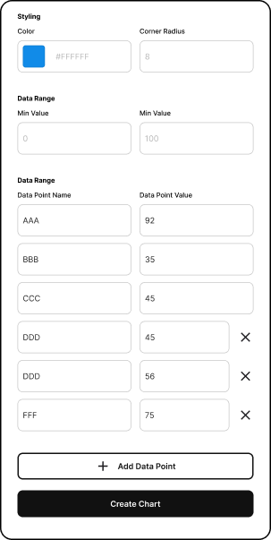

# Radar Chart Figma Plugin

Create custom radar/spider charts directly in Figma with ease!

---

## Features

- **Custom Data Points**: Input your own data points to generate a radar chart tailored to your data.
- **Styling Options**: Customize the appearance of the radar chart with color pickers, rounding inputs, and more.

## UI

## Usage

- Input your desired minimum and maximum values for the data scale.
- Add your data points. By default, you have six data points, but you can add more if needed.
- Customize the appearance using the provided styling options.
- Click "Create Chart" to generate the radar chart on your Figma canvas.

## Feature Roadmap

Radar Chart is in development. Additional features in development are: 
Choose graph style
Number labels for data 
Choose scale division

